### Hi there 👋

<!-- 贪吃蛇动画 - 自动播放，爆炸后显示语言代码雨 -->

  

  

 

<!-- 冷幽默签名 -->

  <samp>
    I write code to automate repetitive tasks, 
    then write more code to automate the automation. 
     
    good good study, day day up
  </samp>

<!--
**SaneHe/SaneHe** is a ✨ _special_ ✨ repository because its `README.md` (this file) appears on your GitHub profile.

Here are some ideas to get you started:

- 🔭 I’m currently working on ...
- 🌱 I’m currently learning ...
- 👯 I’m looking to collaborate on ...
- 🤔 I’m looking for help with ...
- 💬 Ask me about ...
- 📫 How to reach me: ...
- 😄 Pronouns: ...
- ⚡ Fun fact: ...
-->
